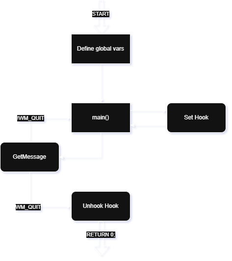
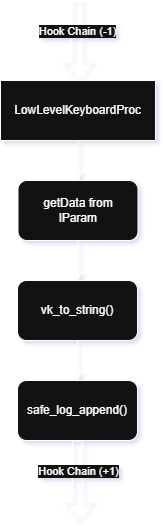

# Educational Keylogger

This short introduction first clarifies important techniques used to understand the functionality of the keylogger, then gives a brief insight on its functionality itself.

## [Windows-API and HOOK Basics](https://learn.microsoft.com/en-us/windows/win32/api/winuser/)

### Keyboard Understanding

#### Virtual Keys

Virtual Keys are the logical virtual meanings associated to keyboard keys. For example when we hit the `Tab` Key, whe logical virtual meaning used by windows is `VK_TAB`.

#### Scan Codes

Scan codes are the physical meanings associated to keyboard keys. The scan codes hold the physical position of the pressed key and are used by the `keyboard controller`.


#### How Applications Receive User-Input in Windows

For people not familiar with computes it may look like this:

```
I open Word-Documents, and the application constantly surveils the keyboard and checks for the input. When I type something, word recognizes that directly and writes the characters into my sheet.
```

That is not how it works. A normal workflow for a Word-Document to receive input from a user would rather look like this:
```
The Keyboard-Controller (Hardware) recognizes, that a key has been pressed. So he sends a notification to the OS with all needed information for the OS to process the input correctly and translate the information into UTF-8 Encoding characters. The OS then forwards the information to the currently focused application (in this case Word) and signals it, that the system got a new input. The only thing Word does after that workflow, is writing the received data into the document.
```

These key fundamentals are important to understand, how HOOKs work in an OS environment.


### HOOKs

When the computer gets some input from the user, the given input runs through a defined chain handling that exact input.\\
A hook links into that chain and can use the passed input data to perform predefined tasks with or on it.

`Example`:
```
InputController -> HookA -> HookB -> ... -> System -> Goal-Application
```
Given the case, the user types something on his keyboard, the "KeyboardController" forwards needed information to the OS, which then assigns it to the active application.

`Example`:
```
Keyboard(A) -> Windows -> Word Document (A)
```
Now we can link our HOOKs right into that workflow and use the forwarded data to perform tasks such as `keylogging`.


### Windows-API Constraints

The Windows-API CALLBACK functions all follow the same structure:
```
LRETURN CALLBACK SomeProc(int nCode, WPARAM wParam, LPARAM lParam);
```

* **LRESULT** = LONG_PTR LRESULT
    - Return code for windows callback functions

* **CALLBACK** = #define CALLBACK _stdcall
    - order parameters from left to right on stack
    - called function cleans the stack afterwards
    - binary-stable names (name-mangling)
    - manages, that function prolog is exactly how windows expects it to be

* **int nCode** = control value from windows->function
    - <0 : don't process (error or bypass) --> CallNextHookEx()
    - =0 : normal action (now legit values are stored in other parameters)
    - \>0 : hook-specific codes (e.g. for filters/previews)

* **WPARAM wParam** = UINT_PTR WPARAM
    - word parameter (numeric/id-values)
    - part of windows messages
    - universal transport container

* **LPARAM lParam** = LONG_PTR LPARAM
    - long parameter (pointer to structs)
    - part of windows messages
    - universal transport container


### WPARAM and LPARAM

Their concrete meaning depends on the msg-type (e.g. Hook-Type).
- for WM_KEYDOWN: wParam holds virtual-key-code (e.g. VK_TAB) and lParam extra info
- for WH_KEYBOARD_LL: lParam hold pointer to a struct containing info

Both parameters guarantee, that the same function interface (LRESULT CALLBACK ...) can be used for any message-type.
If we would not use these containers, we would have to declare a function for any message type:
```
LRESULT CALLBACK HookProc(int nCode, WPARAM wParam, KBDLLHOOKSTRUCT* p);
```
```
LRESULT CALLBACK MouseProc(int nCode, WPARAM wParam, MSLLHOOKSTRUCT* p);
```
```
LRESULT CALLBACK SomeOtherProc(...);
```

#### Usual Workflow how windows fills those containers

First we define the info we want to pass and then fill the param-container with the binary address of some pointer:
```
KBDLLHOOKSTRUCT* info = "some info we want to pass (e.g. a pointer)"

LPARAM lParam = (LPARAM)info;
```


Now the information is stored in lParam and we can retrieve the pointer:
```
KBDLLHOOKSTRUCT* pkb = reinterpret_cast<KBDLLHOOKSTRUCT*>(lParam);
```


## Character Encoding Standards

Key-Terms:
    *`Codepoint` Abstract number that identifies a Unicode character
    *`Codeunit` Smallest storage unit used by a specific encoding (e.g. UTF-8, UTF-16) to represent a codepoint


### 1 Unicode-Concept

Unicode is an `abstraction standard`, not a memory method.

| Character | Name                   | Codepoint |
| ------- | ---------------------- | --------- |
| `A`     | LATIN CAPITAL LETTER A | U+0041    |
| `€`     | EURO SIGN              | U+20AC    |
| `😀`    | GRINNING FACE          | U+1F600   |

So: Unicode is a dictionary of all possible characters -> every one gets own id.

### 2 UTF ("Unicode Transformation Format")

UTfs are `codings` (rules), how these codepoints are saved as `Bytes`.\\
Each encoding defines its `own codeunit size`, and `how many codeunits are needed per codepoint`.

#### Comparison
| Encoding   | Codeunit size     | Codepoints per character | Example (`😀` U+1F600)  |
| ---------- | ----------------- | ------------------------ | ----------------------- |
| **UTF-8**  | 8 bits (1 byte)   | 1–4 codeunits            | `F0 9F 98 80` (4 units) |
| **UTF-16** | 16 bits (2 bytes) | 1–2 codeunits            | `D83D DE00` (2 units)   |
| **UTF-32** | 32 bits (4 bytes) | always 1 codeunit        | `0001F600` (1 unit)     |


#### Example for „😀“ (U+1F600)
| Step           | Description              | Value                         |
| ----------------- | ---------------------- | ---------------------------- |
| Unicode Codepoint | official Id        | U+1F600 (hex) = 128512 (dez) |
| UTF-8             | 4 Bytes                | F0 9F 98 80                  |
| UTF-16            | 2 Code Units à 2 Bytes | D83D DE00                    |
| UTF-32            | 1 Code Unit à 4 Bytes  | 00 01 F6 00                  |

### 3 Interpret UTF

Example for "A😀":
| Character | UTF-8 Bytes   | UTF-16 Code Units | UTF-32 Code Units |
| ------- | ------------- | ----------------- | ----------------- |
| `A`     | `41`          | `0041`            | `00000041`        |
| `😀`    | `F0 9F 98 80` | `D83D DE00`       | `0001F600`        |

| Concept                     | Example            | Explanation           |
| --------------------------- | ------------------ | --------------------- |
| **Codepoint count**         | “😀” = 1 codepoint | one logical character |
| **Codeunit count (UTF-16)** | “😀” = 2 codeunits | surrogate pair        |
| **Byte count (UTF-8)**      | “😀” = 4 bytes     | physical storage size |


UTF-8 => 5 Bytes\\
UTF-16 => 6 Bytes\\
UTF-32 => 8 Bytes\\

### 4 Detection

| Coding | BOM (hex)     | Description     |
| --------- | ------------- | ------------- |
| UTF-8     | `EF BB BF`    | optional      |
| UTF-16 LE | `FF FE`       | Little Endian |
| UTF-16 BE | `FE FF`       | Big Endian    |
| UTF-32 LE | `FF FE 00 00` | –             |
| UTF-32 BE | `00 00 FE FF` | –             |


### 5 Importance for the `KEYLOGGER`

The Win-API expects a WCHAR (UTF-16) Buffer in the
```
ToUniCodeEx()
```
Function, whose return value is the `amount of UTF-16 Codeunits, not bytes`.
In order to write to the log in UTF-8,
we then convert it from UTF-16 to UTF-8 with:
```
int needed = WideCharToMultiByte(CP_UTF8, 0, buf, res, nullptr, 0, nullptr, nullptr);
        if (needed > 0) {
            std::string out(needed, '\0');
            WideCharToMultiByte(CP_UTF8, 0, buf, res, out.data(), needed, nullptr, nullptr);
            return out;
        }
```
* **needed** = holds the amount of bytes needed to store UTF-16 units as UTF-8
* **out(needed, '\0')** = create string with exactly needed bytes initialized to {\0}
* **WideCharToMultiByte** = writes the UTF-16 buffer directly into UTF-8 out.data()
* **return out** = return the result string

### 6 Appendix: Planes

--> unicode separates all characters in "planes" - each with 65536 codepoints (0x0000 - 0xFFFF)

| Plane | Name                                      | Code-Range           | Content                                                                                                                |
| ----- | ----------------------------------------- | -------------------- | --------------------------------------------------------------------------------------------------------------------- |
| **0** | **Basic Multilingual Plane (BMP)**        | `U+0000 – U+FFFF`    | „standard characters“: latin, greek, cyrillic, arabic, kana, CJK basic characters, symbols, emojis (older) |
| 1     | Supplementary Multilingual Plane (SMP)    | `U+10000 – U+1FFFF`  | additional writing systems, mathematical symbols, *new emojis*                                                     |
| 2     | Supplementary Ideographic Plane (SIP)     | `U+20000 – U+2FFFF`  | extended chinese, japanese, korean characters                                                                |
| 3–13  | Reserve                                   | –                    | (not yet occupied or reserved)                                                                                  |
| 14    | Supplementary Special-Purpose Plane (SSP) | `U+E0000 – U+EFFFF`  | control symbols, tags                                                                                                 |
| 15–16 | Private-Use Areas (PUA-A/B)               | `U+F0000 – U+10FFFF` | custom symbols |


## Keylogger.cpp

### Usage

- Compile: g++ -o keylogger keylogger.cpp -luser32
- Requirements to log the keys: file `ENABLE_LOGGING`in work-dir of the keylogger.exe

After the keylogger was started, it simply reads the global input from all current threads and writes it to the specified log-file.
The logger thread can be left by pressing the [ESC]-Key on your keyboard.


### Functionality Flowchart

The functionality of the `keylogger.cpp` needs to be separated from the actual HOOK. They have nothing really in common and we need to view them as two "independent" parts to better understand it for the moment. For both diagrams:\\
Rectangles with smoothened corners are functions that are called by a connected function with right angle corners.



So we can clearly see, that the keylogger.cpp script just administrates the hook, while the hook it self acts separately. By Hook-administration we mean, that it sets the hook, surveils it, and kills it if the program is to be ended.


The `LowLevelKeyboardProc` hook itself runs separately whenever input via the keyboard is received.



As we can see, the defined hook is just another component in the systems hook-chain. It is called from the hook in front of it, and calls the next hook after it did what it wanted (logging the keys).\\
We log the keys by simply reading the data passed in the lParam-pointer, convert that to a legit UTF-8 string and safe it to the log.\\
However, if we press the [ESC]-Key, the Hook will signal the main-thread with the message-loop "asking to be killed". So after receiving the information of the hook, that we received an [ESC], the main shuts down the hook again.